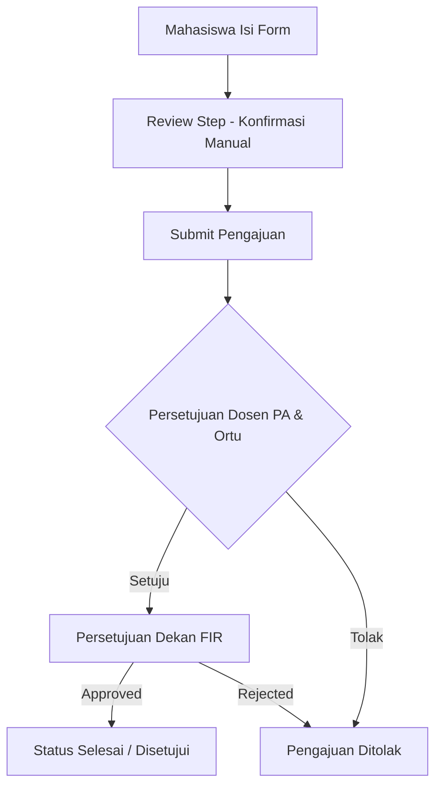

# Product Requirement Document (PRD)
## Sistem Digital Pengajuan Mundur Mata Kuliah
**Fakultas Ilmu Rekayasa (FIR) — Universitas Paramadina**

---

## 1. Pendahuluan & Ringkasan Eksekutif

### 1.1 Latar Belakang
Pengunduran diri dari mata kuliah (Mundur Mata Kuliah) merupakan salah satu hak akademik mahasiswa Universitas Paramadina dengan syarat dan ketentuan teknis tertentu. Sebelumnya, proses ini membutuhkan formulir cetak fisik dan pengumpulan persetujuan manual yang memakan waktu dan berisiko kehilangan berkas.

### 1.2 Tujuan Sistem
Sistem ini hadir untuk mengotomatisasi dan mendigitalisasi alur pengajuan mundur mata kuliah berbasis web modern. Sistem ini mendukung autofill data berbasis akun terautentikasi (Google Workspace Institusional), pemrosesan bertahap (*multi-step wizard*), peninjauan berkas sebelum kirim (*review step*), serta pelacakan status pengajuan secara *real-time*.

---

## 2. Pengguna & Hak Akses (User Roles)

1. **Mahasiswa (Student)**:
   - Login via Google Workspace Institusional.
   - Mengisi formulir pengajuan mundur mata kuliah 5 langkah.
   - Meninjau data lengkap sebelum pengiriman (*Review Step*).
   - Memantau status alur persetujuan pengajuan (Dosen PA, Orang Tua/Wali, Dekan FIR).
   - Melihat riwayat pengajuan terdahulu beserta salinan digital formulir resmi.

2. **Admin UPPS / Pengelola Akademik (Admin)**:
   - Login ke portal kelola admin.
   - Melihat dashboard ringkasan & statistik pengajuan mahasiswa.
   - Meninjau berkas pengajuan mahasiswa.
   - Mengubah status pengajuan (Menyetujui / Menolak) dan memberikan catatan resmi.

---

## 3. Fitur Utama & Spesifikasi Fungsional

### 3.1 Otentikasi & Autofill Session
- Login menggunakan akun Google Workspace (Simulasi Google OAuth).
- Data mahasiswa (Nama, NIM, Program Studi, Semester/Tahun Ajaran) terisi secara otomatis (*autofill*) berdasarkan profil akun login.

### 3.2 Formulir Multi-Step (5 Langkah)
1. **Langkah 1 (Ketentuan & Prosedur)**:
   - Penjelasan aturan resmi (misal: SKS tidak dihitung, biaya tidak dikembalikan, batas waktu pertemuan ke-2).
   - Checklist persetujuan ketentuan.
2. **Langkah 2 (Data Diri Mahasiswa)**:
   - Tampilan data autofill (read-only).
   - Pengisian Alamat Lengkap tempat tinggal saat ini.
3. **Langkah 3 (Daftar Mata Kuliah)**:
   - Pemilihan mata kuliah dari katalog atau pengisian manual kode, nama MK, dan SKS.
   - Penghitungan otomatis total SKS yang diundurkan.
4. **Langkah 4 (Alasan & Konfirmasi PA)**:
   - Pengisian alasan objektif pengunduran diri.
   - Konfirmasi persetujuan dari Dosen Pembimbing Akademik (PA).
5. **Langkah 5 (Review & Konfirmasi Akhir)**:
   - **Mandatory Review**: Ringkasan lengkap Data Mahasiswa, Daftar Mata Kuliah, dan Alasan.
   - **Manual Submission Only**: Pengajuan hanya dapat dikirimkan secara manual oleh pengguna setelah memeriksa ulang seluruh berkas di langkah review ini.

### 3.3 Pelacakan Status Real-Time (Status Tracking)
- Visualisasi diagram alur status: `MENUNGGU` → `DISETUJUI` / `DITOLAK`.
- Timeline persetujuan Dosen PA, Orang Tua/Wali, dan Dekan FIR.

### 3.4 Cetak / Tampilan Surat Resmi Digital
- Halaman tampilan berkas resmi sesuai format cetak universitas, dilengkapi nomor pengajuan unik, daftar MK, alasan, serta area tanda tangan digital/stempel persetujuan.

### 3.5 Dashboard & Riwayat Pengajuan
- Pencarian dan pemfilteran pengajuan berdasarkan status dan kata kunci.
- Riwayat lengkap yang disimpan dalam sesi aplikasi.

---

## 4. Persyaratan Non-Fungsional & Desain UI/UX

1. **Aestetika & Branding**:
   - Palette warna sesuai warna resmi Universitas Paramadina: Biru Madani (`#0B2447` - `#123C69`), Abu-abu Al-Quds, Emerald (Status disetujui), dan Rose (Status ditolak/perhatian).
   - Tipografi bersih berbasis font modern (Inter/Sans-serif).
2. **Responsivitas**:
   - Layout fully-responsive untuk tampilan Ponsel (Mobile), Tablet, dan Desktop.
3. **Arsitektur Kode & Teknologi**:
   - Framework: **Next.js 14+ (App Router)**.
   - Styling: **Tailwind CSS**.
   - Logic & UI: **JavaScript (JSX / JS)** murni tanpa tipe data statis.

---

## 5. Diagram Status Pengajuan (Status Lifecycle)

